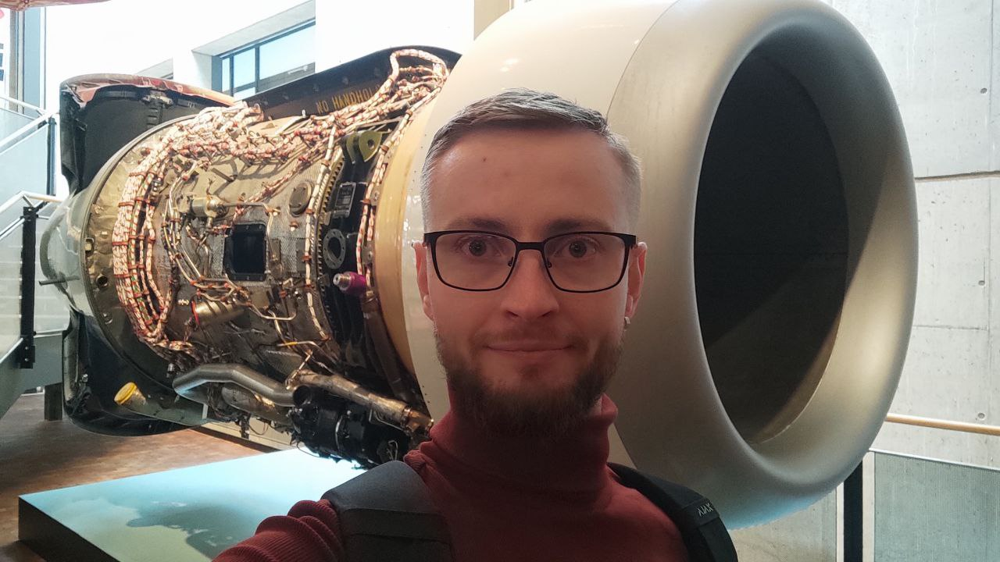
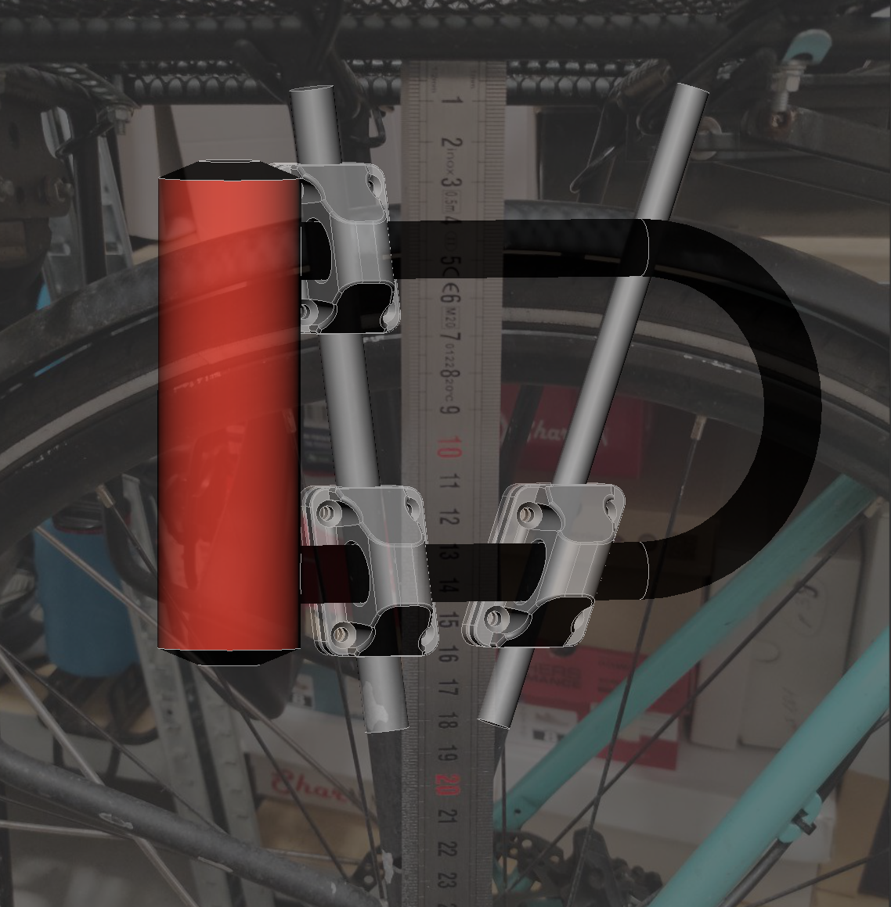

# Overcome Your Challenges Today

**Prototype** passes bench tests but fails in production. No repeatable test fixture. First 100 units failing certification checks.

**Scaling startup** and ramping from pilot to 1k+/month brings yield drop. Supplied parts variance breaking line flow.

**Legacy line** upgrade for new product variant encounter major CAPEX, 90-minute changeovers and poor line balance.

  

    <a class="cta-btn"
       href="https://calendly.com/zhokhovom/1h"
       target="_blank"
       rel="noopener noreferrer"
       aria-label="Book a one hour meeting with Oleksii on Calendly"
       onclick="gtag('event', 'calendly_booking_click', {
         event_category: 'engagement',
         event_label: 'primary_cta',
         value: 1
       });">
      Schedule free call
    </a>
  

## What you need —  Hands-on NPI & Production Engineering {#what-you-need}

I’m Oleksii — and I turn prototypes into manufacturable systems and stabilise existing lines. I deliver DFM, equipment validation, SMED, on-site commissioning and targeted retrofits for startups and SMEs, resulting in production-ready pilots, faster launches, and lower NPI risk with sustainability-aware decisions.

## What I offer {#what-i-do}

1. Manufacturing process audit.
2. DFM analysis, assembly process optimisation.
3. Pilot planning, launch checklist.
4. Test procedure & fixture design.
5. Open-floor brainstorming.

## How I work

1. Online. On-site visits across EU possible.
2. Free introductory session for each project.
3. B2B, B2C, non-profit cooperation available.
4. Languages spoken: English, Polish, Ukrainian.
5. Pricing upon request.

## Project Showcase {#my-work-portfolio}

Just a brief example of the projects I perform. The scale varies:

- **Hobby** (personal, non-commercial, one-time solution)
- **Small** (hand-held prototype or product)
- **Medium** (industrial solution, QMS involved)
- **Large** (CAPEX, strategic, safety involved)

- ### **Bicycle Lock Holder**

    

    **Scale:** Hobby

    In this project I overcame bicycle frame limitations and adjusted to user riding style. Inspiration of the design came from open-source designs on Thingiverse.com and Printables.com.

- ### **Measuring Fixture**

    

    **Scale:** Medium

    Quality control tool for periodic dimensional and tolerance checks of special product characteristic in serial production. Fixture adapted for regular production personnel with minimal training needed.

    Design features for easy handling and practical storage implemented. MSA completed and 3+ years of successful usage confirmed based on the customer feedback.

- ### **Automatic Assembly Line**

    
    

    **Scale:** Large

    Absolute beast producing millions of electromechanical switches per year. Automated parts feeding, inbuilt calibration and final quality control. Designed from scratch.
    
    My impact was in pneumatic system design, mechanics optimisation, ergonomics, algorithm and HMI architecture. Full-scale launch tests and handover to serial production support included.

- ### **Electro-pneumatical Assembly Jig**

    

    **Scale:** Medium

    Typical equipment for automated production lines. Two assembly operations combined into a single carriage, inbuilt process quality control, passive and active safety features.
    
    I created standardised framework for pneumatical system design and documentation, implemented system scalability options, performed setup and production handover to operations. Successfully facilitated the production of 20+ custom jigs within the established framework. 

- ### **Stackable Trays for Stationery**

    
    

    **Scale:** Hobby

    Prototype of custom trays to carry different kind of stationery. The key problem to overcome was limited storage space. 
    
    Inspired by open-source designs and online research I designed and recreated the prototype using FDM printing.

- ### **More still ahead...**

---

## Contact {#contact}

Direct discussion is usually the fastest way to evaluate fit.

📩 **zhokhovom@gmail.com**  
🔗 [LinkedIn](https://www.linkedin.com/in/oleksii-zhokhov/)  
📅 [Book a 1-hour call](https://calendly.com/zhokhovom/1h)

